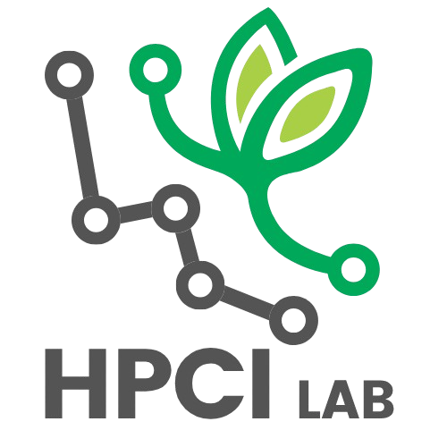

<div align="center">
  <a href="https://github.com/HPCI-Lab">
    
  </a>

  <h3 align="center">yProv4DA</h3>

  <p align="center">
    A python utility for automatically packaging code, inputs and outputs of data visualization scripts. 
    <br />
    <a href="https://hpci-lab.github.io/yProv4DV/"><strong>Explore the docs »</strong></a>
    <br />
    <br />
    <a href="https://github.com/HPCI-Lab/yProv4DV/issues/new?labels=bug&template=bug-report---.md">Report Bug</a>
    &middot;
    <a href="https://github.com/HPCI-Lab/yProv4DV/issues/new?labels=enhancement&template=feature-request---.md">Request Feature</a>
  </p>
</div>

<br />

[](https://github.com/HPCI-Lab/yProv4DV/graphs/contributors)
[](https://github.com/HPCI-Lab/yProv4DV/network/members)
[](https://github.com/HPCI-Lab/yProv4DV/stargazers)
[](https://github.com/HPCI-Lab/yProv4DV/issues)
[](https://opensource.org/licenses/)

# yProv4DV

yProv4DV (Data Visualization) is a python utility which allows for packaging of code, inputs and outputs of data visualization scripts. Once integrated, it will produce a zip file which includes all information necessary for reproducibility of the current script, including a copy of the files used. This library is part of the [yProv](https://github.com/HPCI-Lab/yProv) framework, which means it can also produce W3C-prov compliant files useful for interpretability and reproducibility. 

# Installation

```bash
pip install yprov4dv
```

# Current Compatibility

Currently, the yProv4DV library is able to track input files which are opened by the following libraries: 
 - [pandas](https://pandas.pydata.org/) (read_csv, read_parquet, read_excel, read_json)
 - [xarray](https://docs.xarray.dev/en/stable/index.html) (open_dataset, open_mfdataset)
 - [geopandas](https://geopandas.org/en/stable/getting_started/introduction.html) (read_file)
 - [numpy](https://numpy.org/) (load)
 - [torch](https://pytorch.org/) (load)
 - [rasterio](https://rasterio.readthedocs.io/en/latest/index.html) (open)
 - As well as the standard python calls (such as open())

Additionally, if data is plotted using: 
 - [matplotlib](https://matplotlib.org/) (plot, bar, ...)
 - [seaborn](https://seaborn.pydata.org/) (scatterplot, lineplot, barplot, histplot, boxplot)
Then the subset of data used only for visualization can be saved in an isolated file (by setting the `save_input_files_subset` option to `True`). 

Any type of output files generated during the execution of the program will also be logged, indipendently of file type. 

# Example

Inside the `examples` folder is contained an example of a simple data visualization script in python. It is already integrated with the yProv4DV library, and can be run with the prompt: 

```bash
python ./examples/simple.py
```

This execution will create: 
- The `prov` directory (which is customizable) and will hold all the information for the current execution, so `inputs`, `outputs` and source code (`src`), all in their respective folders. Additionally, in the same directory, the library creates a set of provenance files, containing a description of the current execution (in `.json`, `dot` and `svg` formats). 
- `prov.zip`: containining all the aforementioned information in a zipped [RO-Crate](https://www.researchobject.org/ro-crate/).  

# Parameters

To keep the number of yprov4dv calls to a minimum, the library exposes just three directives: 
 - `def start_run(*args)`
 - `def log_input(path_to_untracked_file)`
 - `def log_output(path_to_untracked_file)`

The behaviour of yProv4DV can be changed passing parameters to the `start_run` function. 
All possible fields are listed below: 

- `provenance_directory`: (str) changes where the inputs, outputs and code directory are stored; 
- `prefix`: (str) changes the prefix given to fields in the provenance document; 
- `run_name`: (str) changes the run name inside the provenance file; 
- `create_json_file`: (`True` or `False`) whether the json file is created or not; 
- `create_dot_file`: (`True` or `False`) whether the dot file is created or not, cannot be `True` if `YPROV4DV_CREATE_JSON_FILE` is `False`; 
- `create_svg_file`: (`True` or `False`) whether the svg file is created or not, cannot be `True` if `YPROV4DV_CREATE_JSON_FILE` or `YPROV4DV_CREATE_DOT_FILE` are `False`; 
- `create_rocrate`: (`True` or `False`) whether the ro-crate zip is created or not; 
- `default_namespace`: (str) changes the default namespace inside the provenance file
- `save_input_files_full`: (str) decides whether input files are saved in full
- `save_input_files_subset`: (str) decides whether inputs are saved as a subset (only the plotted data)
- `skip_files_larger_than`: (int) In Mb, files larger than the threshold will not be copied;
- `verbose`: (`True` or `False`), 

For an example, run: 

```bash
python ./examples/customized.py
```
